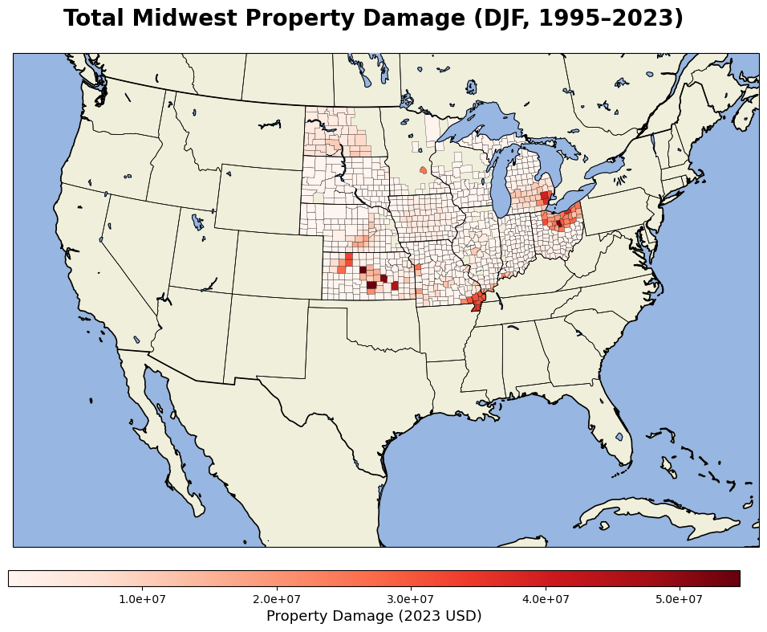
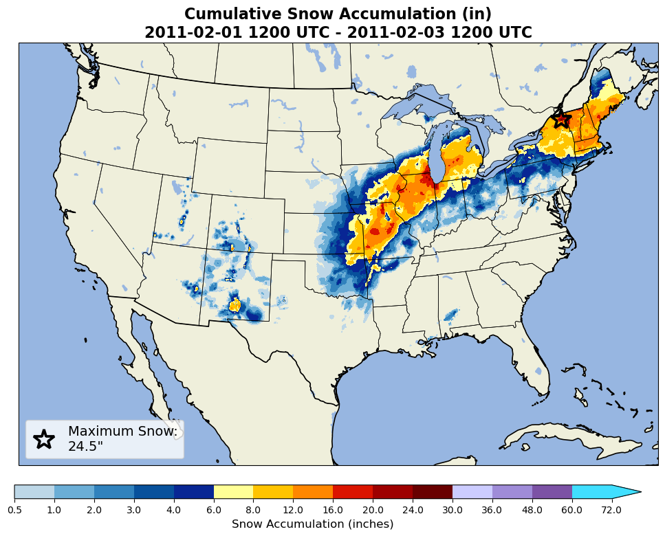
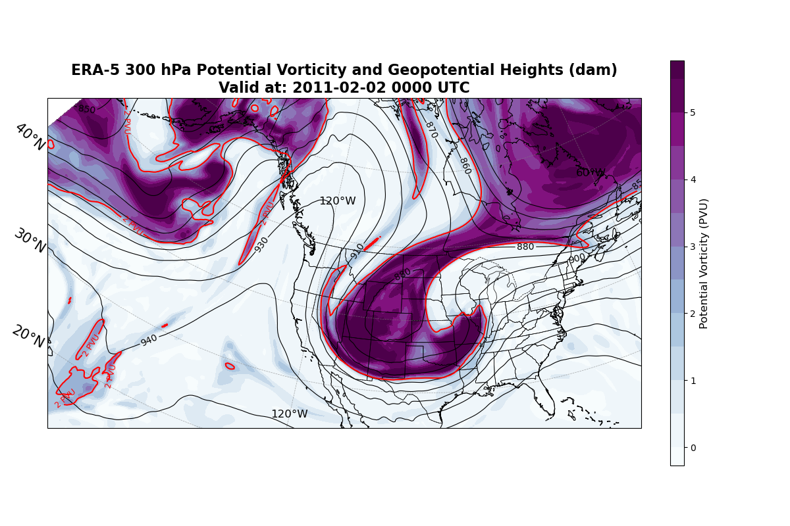

# Winter Weather Property Damage Analysis
Combining mapping analyses of: 1. county-level winter weather loss (SHELDUS), 2. snowfall accumulation (NOHRSC), and 3. different reanalysis weather variables (ERA5) to identify key drivers of Midwest DJF property damage.

1. 
2. 
3. 

---

## Overview

This research hopes to better detail the regions of the Midwest that are most vulnerable to property damages induced by winter weather, and relate these events to large-scale atmospheric drivers.

This research involved 3 sections:

1. **Loss Analysis (SHELDUS):** County-level property damage from winter weather, wind, hail, and severe storms across the Midwest states during DJF months, from 1995-2023, as the ERA5 data we have so far is downloaded back to 1995. Here, an analysis is done of the property damage per event, the total damage per county over that time period, and the difference in property damage per year from 1982 to 1995 and 1995 to 2023.

2. **Snowfall Analysis (NOHRSC):** Event-level snowfall accumulation maps using NOHRSC 24-hour snowfall data. This code can produce 4 types of visualizations: cumulative total of snowfall, single-day maximum, standard deviation, and days that snowed above a user-set threshold. 

3. **Atmospheric Diagnostics (ERA5):** Upper-air composite maps for high-damage event 
   dates, including:
   - `Integrated Vapor Transport (IVT) and MSLP`: moisture flux, atmospheric rivers, and surface pressure
   - `Wind Speeds and Geopotential Height`: jet streak, regions of ascent, and upper-level motion
   - `Temperature and Geopotential Height`: thermal structure and large-scale flow
   - `Potential Vorticity and Geopotential Height`: upper-level forcing and tropopause dynamics

---

## Status

This project is actively in development. Planned next steps:
- ERA5 composite maps overlaid on SHELDUS county damage figures
- NWS winter weather warning shapefile overlay and verification
- Insurance/reinsurance loss modeling applications

---
### Requirements
```
pandas
geopandas
numpy
matplotlib
cartopy
xarray
cfgrib
metpy
dask
```
